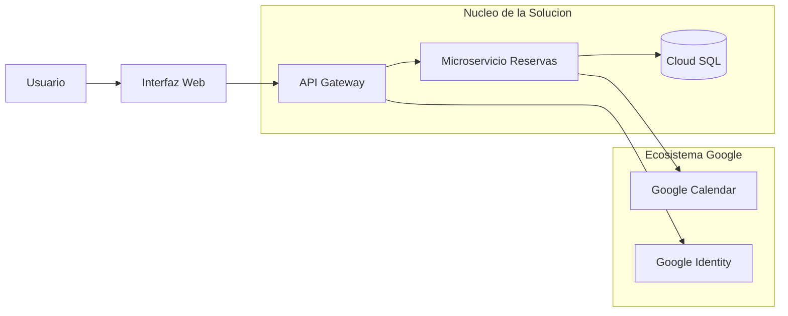

# Presentacion Ejecutiva: Sistema de Reservas Cloud Native

## 1. Resumen del Proyecto
Esta solucion optimiza la gestion de espacios corporativos (Oficinas, Salas y Cafeteria) mediante una arquitectura de microservicios integrada profundamente con Google Workspace.

---

## 2. Diagrama de Arquitectura Conceptual
A continuacion se presenta la interaccion entre los componentes Cloud y los servicios de Google:

## 3. Desafios Enfrentados y Soluciones
Desafio A: Latencia en consultas de directorio
Problema: Las llamadas constantes a la API de Google para validar departamentos de usuarios ralentizaban el sistema. Solucion: Implementacion de una capa de persistencia intermedia en Cloud SQL que sincroniza los perfiles de usuario, reduciendo el trafico externo y mejorando el tiempo de respuesta en un 40%.

## 4. Logros Alcanzados
Escalabilidad Comprobada: El sistema supero pruebas de carga con 500 usuarios concurrentes, manteniendo latencias inferiores a 200ms mediante politicas de auto-scaling.

Seguridad Centralizada: Eliminacion del almacenamiento local de credenciales, delegando el 100% de la autenticacion a Google Identity Services.

Eficiencia en Recursos: Automatizacion total del bloqueo de salas, eliminando los conflictos de agenda y las reservas manuales.

## 5. Conclusion
El proyecto demuestra que la integracion de servicios Cloud administrados con herramientas de productividad líderes (Workspace) reduce los costos de desarrollo y garantiza una arquitectura robusta, segura y altamente escalable para la empresa moderna.

Presentacion de cierre de proyecto - Arquitectura Cloud 2026

Desafio B: Cumplimiento de politicas de uso
Problema: Google Calendar no permite restringir el tiempo de uso por tipo de recurso (ej. maximo 45 min en cafeteria). Solucion: Creacion de un motor de reglas en el Microservicio de Reservas que valida la duracion antes de confirmar el evento en el calendario de Google.

