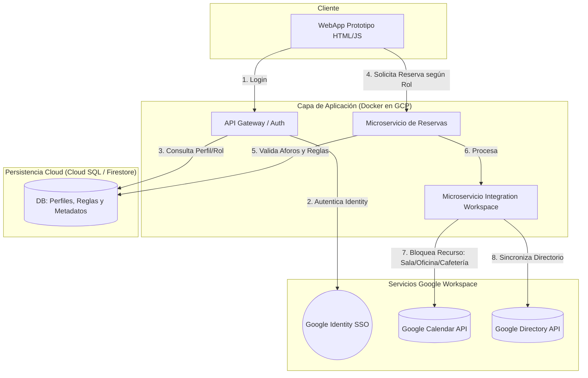

# Sistema de Reservas Corporativas (Cloud Native)

Este proyecto es una solución de arquitectura diseñada para la gestión eficiente de recursos físicos (Salas de reuniones, Oficinas y Cafetería). Se utiliza el supuesto de que la empresa que ha solicitado esta solución, cuenta con Google Workspace, por lo tanto se pone énfasis en el aprovechamiento de la infraestructura de **Google Workspace**.

## Arquitectura del Sistema
- **Frontend:** WebApp interactiva (HTML5/JS).
- **Backend:** Microservicios desacoplados en contenedores Docker.
- **Persistencia:** Google Cloud SQL para reglas de negocio y perfiles.
- **Seguridad:** Autenticación vía Google SSO (OAuth 2.0).

## Características Principales
- **Gestión de Aforos:** Control en tiempo real para la Cafetería.
- **Sincronización:** Integración bidireccional con Google Calendar.
- **Roles de Usuario:** Niveles de acceso (Colaborador, Admin, Super Admin).

---
*Proyecto desarrollado para el portafolio de Arquitectura Cloud - 2026*

## Despliegue Local
Para ejecutar este proyecto en un entorno de desarrollo:
1. Clonar el repositorio: `git clone [URL_DEL_REPO]`
2. Instalar dependencias: `npm install` (o el comando del lenguaje usado).
3. Configurar variables de entorno (`.env`) con las credenciales de Google Cloud Console.
4. Levantar los servicios con Docker: `docker-compose up --build`

   
