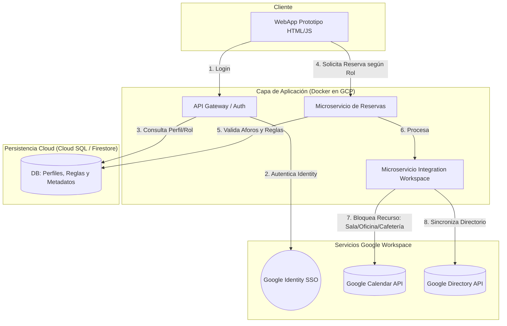

```mermaid
graph TD
    subgraph Cliente
    A[WebApp Prototipo HTML/JS]
    end

    subgraph "Capa de Aplicación (Docker en GCP)"
    B[API Gateway / Auth]
    C[Microservicio de Reservas]
    D[Microservicio Integration Workspace]
    end

    subgraph "Persistencia Cloud (Cloud SQL / Firestore)"
    H[(DB: Perfiles, Reglas y Metadatos)]
    end

    subgraph "Servicios Google Workspace"
    E((Google Identity SSO))
    F[(Google Calendar API)]
    G[(Google Directory API)]
    end

    A -->|1. Login| B
    B -->|2. Autentica Identity| E
    B -->|3. Consulta Perfil/Rol| H
    A -->|4. Solicita Reserva según Rol| C
    C -->|5. Valida Aforos y Reglas| H
    C -->|6. Procesa| D
    D -->|7. Bloquea Recurso: Sala/Oficina/Cafetería| F
    D -->|8. Sincroniza Directorio| G
```
